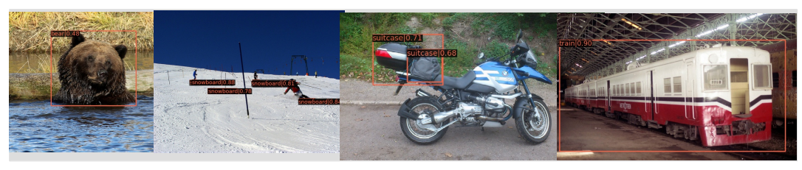

# Augmenting Zero-Shot Detection Training with Image Labels
[](https://opensource.org/licenses/Apache-2.0)
[](https://pytorch.org/)

This repository contains the official implementation of our technical report:

**Augmenting Zero-Shot Detection Training with Image Labels**<br>
Ulla Scheler, Katharina Kornmeier and Pascal Herrmann<br>
[[arXiv](https://arxiv.org/abs/2306.06899)]

| <br> |
|:--:|
| <p align="left">We use image labels to better align the detector output to the embedding space and thus boost detection performance on unseen COCO classes (here, e.g. bear, snowboarder, suitcase, train) by 3.3 mAP.</p> |

---

**Sources**

This installation guide combines information from the following guidelines with the properly compatible package versions for our GPU setup (CUDA 10.1). Please adapt the package versions to your setup if necessary.
 
<https://github.com/open-mmlab/mmdetection/blob/master/docs/get_started.md>

<https://mmcv.readthedocs.io/en/latest/get_started/installation.html>

<https://mmcv.readthedocs.io/en/latest/get_started/build.html>

**Steps**

1. Clone [mmcv](https://github.com/rumozam/mmcv) and [mmdetection](https://github.com/rumozam/zero-shot-detection) from our repositories to your machine.
2. Optional: Install Miniconda <https://conda.io/projects/conda/en/latest/user-guide/install/linux.html>
3. Create a Miniconda virtual environment and activate it.

   ```plaintext
   conda create -n zsd_env python=3.8 -y
   conda activate zsd_env
   ```
4. Install packages.

   ```plaintext
   conda install pytorch==1.8 torchvision==0.9.0 cudatoolkit=10.1 -c pytorch -c conda-forge
   conda install pytorch==1.10 torchvision==0.11.1 torchaudio==0.10.0 cudatoolkit=11.3 -c pytorch -c conda-forge
   
   ```
5. Install mmcv (full version) from local repository.

   ```plaintext
   cd mmcv
   MMCV_WITH_OPS=1 python setup.py develop
   ```
6. Install mmdetection (with minimum runtime requirements) from local repository.

   ```plaintext
   cd ../zero-shot-detection
   pip install -r requirements/build.txt
   python setup.py develop
   
   ```